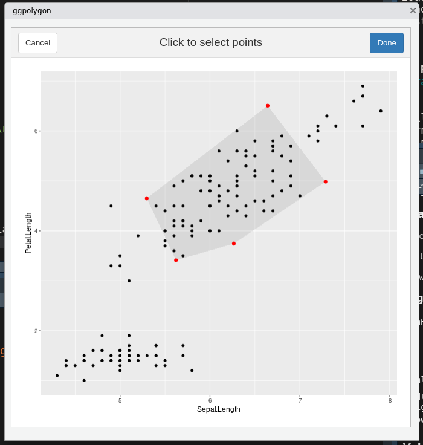

<!-- README.md is generated from README.Rmd. Please edit that file -->

```{r, include = FALSE}
knitr::opts_chunk$set(
  collapse = TRUE,
  comment = "#>",
  fig.path = "man/figures/README-",
  out.width = "100%"
)
```

# flowhelperrr

<!-- badges: start -->
<!-- badges: end -->

The goal of flowhelperrr is to help you do flow cytometry analysis on R using
data frames

## Installation

``` r
devtools::install_github("jspaezp/flowhelperrr")
```

## Examples


```{r example}
library(flowhelperrr)
library(ggplot2)
## basic example code
```

### Operations using Polygons

Gates can be defined as polygons in a data frame. Such data frames can be used
to check what points are inside such polygons.

```{r}
poly_selection <- data.frame(
    Petal.Length = c(2,4,6),
    Sepal.Width = c(2,4,2))

is_point_in_path(
    iris$Petal.Length,
    iris$Sepal.Width,
    poly_selection)
```

Since it is vectorized it can be used as well in NSE

```{r}
iris2 <- dplyr::mutate(
    iris,
    point_in_poly = is_point_in_path(
        Petal.Length,
        Sepal.Width,
        poly_selection))

head(iris2)
```


```{r}
ggplot(iris, aes(x = Petal.Length, y = Sepal.Width,
                 colour = is_point_in_path(Petal.Length, Sepal.Width, poly_selection))) +
    geom_point() +
    geom_polygon(colour = "gray", alpha = 0.3, data = poly_selection) +
    theme(legend.position = "bottom")
```

### Shiny Gadgets

Gadgets are provided to help with the things that are hard to do exclusively
on the command line (such as making an octagonal gate ...)

*ggpolygon*

This gadget allows you to click to form a polygon and returns a data frame
that defines such polygon

```r
ggpolygon(iris, "Sepal.Length", "Petal.Length")
```



    To generate the data.frame, type 
    'data.frame(c(5.29656915230736, 5.62182752573929, 6.26495203684332, 7.28508057169799, 6.64195606059396), c(4.65156384997072, 3.41011046538746, 3.74383449350124, 4.9852878780845, 6.50706944628333))'
      Sepal.Length Petal.Length
    1     5.296569     4.651564
    2     5.621828     3.410110
    3     6.264952     3.743834
    4     7.285081     4.985288
    5     6.641956     6.507069

## Things to run before commiting

```r
devtools::test()
devtools::document()
devtools::build_site()
```

