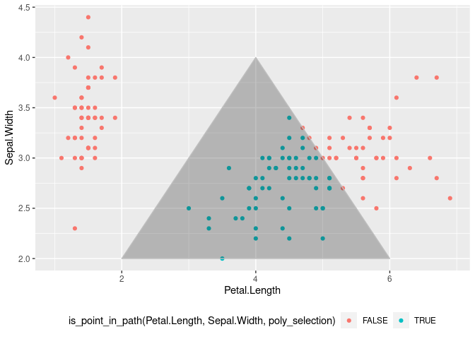
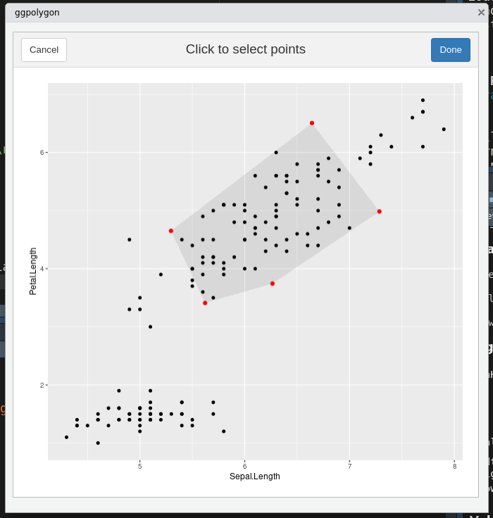

<!-- README.md is generated from README.Rmd. Please edit that file -->

# flowhelperrr

<!-- badges: start -->

<!-- badges: end -->

The goal of flowhelperrr is to help you do flow cytometry analysis on R
using data frames

## Installation

``` r
devtools::install_github("jspaezp/flowhelperrr")
```

## Examples

``` r
library(flowhelperrr)
#> Loading required package: shiny
#> Loading required package: miniUI
library(ggplot2)
## basic example code
```

### Operations using Polygons

Gates can be defined as polygons in a data frame. Such data frames can
be used to check what points are inside such polygons.

``` r
poly_selection <- data.frame(
    Petal.Length = c(2,4,6),
    Sepal.Width = c(2,4,2))

is_point_in_path(
    iris$Petal.Length,
    iris$Sepal.Width,
    poly_selection)
#>   [1] FALSE FALSE FALSE FALSE FALSE FALSE FALSE FALSE FALSE FALSE FALSE FALSE
#>  [13] FALSE FALSE FALSE FALSE FALSE FALSE FALSE FALSE FALSE FALSE FALSE FALSE
#>  [25] FALSE FALSE FALSE FALSE FALSE FALSE FALSE FALSE FALSE FALSE FALSE FALSE
#>  [37] FALSE FALSE FALSE FALSE FALSE FALSE FALSE FALSE FALSE FALSE FALSE FALSE
#>  [49] FALSE FALSE  TRUE  TRUE FALSE  TRUE  TRUE  TRUE FALSE  TRUE  TRUE  TRUE
#>  [61]  TRUE  TRUE  TRUE  TRUE  TRUE  TRUE  TRUE  TRUE  TRUE  TRUE FALSE  TRUE
#>  [73]  TRUE  TRUE  TRUE  TRUE  TRUE FALSE  TRUE  TRUE  TRUE  TRUE  TRUE  TRUE
#>  [85]  TRUE  TRUE  TRUE  TRUE  TRUE  TRUE  TRUE  TRUE  TRUE  TRUE  TRUE  TRUE
#>  [97]  TRUE  TRUE  TRUE  TRUE FALSE  TRUE FALSE FALSE FALSE FALSE  TRUE FALSE
#> [109] FALSE FALSE FALSE FALSE FALSE  TRUE  TRUE FALSE FALSE FALSE FALSE  TRUE
#> [121] FALSE  TRUE FALSE  TRUE FALSE FALSE  TRUE  TRUE FALSE FALSE FALSE FALSE
#> [133] FALSE  TRUE FALSE FALSE FALSE FALSE  TRUE FALSE FALSE FALSE  TRUE FALSE
#> [145] FALSE FALSE  TRUE FALSE FALSE FALSE
```

Since it is vectorized it can be used as well in NSE

``` r
iris2 <- dplyr::mutate(
    iris,
    point_in_poly = is_point_in_path(
        Petal.Length,
        Sepal.Width,
        poly_selection))

head(iris2)
#>   Sepal.Length Sepal.Width Petal.Length Petal.Width Species point_in_poly
#> 1          5.1         3.5          1.4         0.2  setosa         FALSE
#> 2          4.9         3.0          1.4         0.2  setosa         FALSE
#> 3          4.7         3.2          1.3         0.2  setosa         FALSE
#> 4          4.6         3.1          1.5         0.2  setosa         FALSE
#> 5          5.0         3.6          1.4         0.2  setosa         FALSE
#> 6          5.4         3.9          1.7         0.4  setosa         FALSE
```

``` r
ggplot(iris, aes(x = Petal.Length, y = Sepal.Width,
                 colour = is_point_in_path(Petal.Length, Sepal.Width, poly_selection))) +
    geom_point() +
    geom_polygon(colour = "gray", alpha = 0.3, data = poly_selection) +
    theme(legend.position = "bottom")
```



### Shiny Gadgets

Gadgets are provided to help with the things that are hard to do
exclusively on the command line (such as making an octagonal gate …)

*ggpolygon*

This gadget allows you to click to form a polygon and returns a data
frame that defines such polygon

``` r
ggpolygon(iris, "Sepal.Length", "Petal.Length")
```



    To generate the data.frame, type 
    'data.frame(c(5.29656915230736, 5.62182752573929, 6.26495203684332, 7.28508057169799, 6.64195606059396), c(4.65156384997072, 3.41011046538746, 3.74383449350124, 4.9852878780845, 6.50706944628333))'
      Sepal.Length Petal.Length
    1     5.296569     4.651564
    2     5.621828     3.410110
    3     6.264952     3.743834
    4     7.285081     4.985288
    5     6.641956     6.507069

## Things to run before commiting

``` r
devtools::test()
devtools::document()
devtools::build_site()
```
